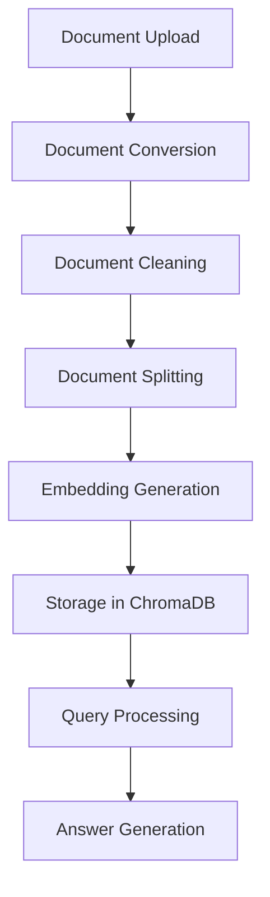

# Document Q&A System

[](https://www.python.org/downloads/)
[](https://haystack.deepset.ai/)

A powerful document question-answering system built with Haystack, featuring a user-friendly Jupyter notebook interface. This system allows users to upload PDF or Word documents and ask questions about their content using advanced RAG (Retrieval-Augmented Generation) technology.

## ✨ Features

- 📄 **Document Upload**: Support for PDF and Word documents (.pdf, .doc, .docx)
- 🖥️ **Interactive UI**: User-friendly Jupyter notebook interface with file upload and question submission
- 🤖 **Advanced RAG**: Uses Haystack pipeline with embedding retrieval and local LLM generation
- 🔤 **Multiple Embedding Models**: Supports Jina and FastEmbed embedding models
- 🧠 **Local LLM**: Uses Mistral-7B-Instruct-v0.2 model with 4-bit quantization for efficient local inference
- 📝 **Document Processing**: Automatic document cleaning, splitting, and embedding generation
- ⚡ **Real-time Q&A**: Ask questions and get answers based on document content with page references

## 🔧 Prerequisites

- Python 3.10+
- CUDA-compatible GPU (recommended for optimal performance)
- Hugging Face account and API token
- At least 8GB RAM (16GB recommended)
- 10GB free disk space for model caching

## 🚀 Installation

### Option 1: Clone Repository
```bash
git clone https://github.com/yourusername/document-qa-system.git
cd document-qa-system
```

### Option 2: Download Notebook
Download the Jupyter notebook directly to your local environment.

### Install Dependencies
```bash
pip install haystack-ai
pip install haystack-integrations
pip install ipywidgets
pip install python-dotenv
pip install torch
pip install transformers
pip install chromadb
```

### Environment Setup
Create a `.env` file in the same directory as the notebook:
```env
HF_API_TOKEN=your_huggingface_token_here
```

> **Note**: Get your Hugging Face token from [https://huggingface.co/settings/tokens](https://huggingface.co/settings/tokens)

## ⚡ Quick Start

1. **Open the Jupyter notebook**:
   ```bash
   jupyter notebook "test_run_UI_trial-2 (1).ipynb"
   ```

2. **Run the authentication cell** to connect with Hugging Face:
   ```python
   from getpass import getpass
   import os
   from dotenv import load_dotenv
   # ... (authentication code)
   ```

3. **Run all setup cells** to initialize the system:
   - Document store setup
   - Model loading
   - Pipeline configuration

4. **Upload a document** using the file upload widget

5. **Start asking questions** in the Q&A interface!

## 📖 Usage

### Step 1: Upload Document
1. Use the file upload widget in the notebook
2. Select a PDF or Word document (.pdf, .doc, .docx)
3. The system will automatically:
   - Save the file locally
   - Process and embed the document
   - Initialize the Q&A pipeline

### Step 2: Ask Questions
1. Use the question input widget
2. Type your question about the document content
3. Click "Submit Question" to get an answer
4. The system will provide answers with page references when available

### Example Usage
```python
# The system automatically handles the pipeline
result = query_pipeline.run(data={
    "text_embedder": {"text": "What are the testing requirements?"},
    "retriever": {"top_k": 20},
    "prompt_builder": {"question": "What are the testing requirements?"},
    "generator": {"generation_kwargs": {"max_new_tokens": 600}}
})
```

## 🏗️ System Architecture

### Components
- **Document Store**: ChromaDB for vector storage
- **Embedding Model**: FastEmbed with Jina embeddings
- **Retriever**: ChromaEmbeddingRetriever for similarity search
- **Generator**: Local Mistral-7B-Instruct model with 4-bit quantization
- **Pipeline**: Haystack pipeline connecting all components

### Processing Pipeline


1. **Document Upload** → File saved to local directory
2. **Document Conversion** → PDF/DOCX to text extraction
3. **Document Cleaning** → Remove headers/footers and repeated content
4. **Document Splitting** → Split into 500-word chunks
5. **Embedding Generation** → Create vector embeddings
6. **Storage** → Store in ChromaDB document store
7. **Query Processing** → Embed question and retrieve relevant chunks
8. **Answer Generation** → Generate answer using local LLM

## ⚙️ Configuration

### Model Settings
- **Embedding Model**: `jinaai/jina-embeddings-v2-base-en`
- **LLM Model**: `mistralai/Mistral-7B-Instruct-v0.2`
- **Quantization**: 4-bit with double quantization
- **Max Tokens**: 400-600 for responses
- **Temperature**: 0.3 for controlled generation

### Performance Settings
- **Chunk Size**: 500 words per document segment
- **Retrieval**: Top 20 most relevant chunks
- **Threads**: 2 for embedding generation
- **Cache Directory**: `embed_cache` for model caching

### Customization
You can modify these settings in the notebook:
```python
# In load_model() function
generation_kwargs={
    "max_new_tokens": 400,    # Adjust response length
    "temperature": 0.3,        # Control creativity
    "top_p": 0.9              # Nucleus sampling
}

# In embedding_doc() function
splitter = DocumentSplitter(split_by="word", split_length=500)  # Adjust chunk size
```

## 📁 File Structure

```
project/
├── test_run_UI_trial-2 (1).ipynb    # Main notebook
├── .env                              # Environment variables
├── embed_cache/                      # Model cache directory
├── llama_test/voila_uploaded_files/  # Uploaded documents
├── requirements.txt                   # Python dependencies
├── .gitignore                        # Git ignore file
└── README.md                         # This file
```

## 🔧 API Reference

### Main Functions

#### `load_model(retriever)`
Initializes the Q&A pipeline with the specified retriever.

**Parameters:**
- `retriever`: ChromaEmbeddingRetriever instance

**Returns:**
- Global `query_pipeline` object

#### `embedding_doc(file_path)`
Processes and embeds a document for Q&A functionality.

**Parameters:**
- `file_path`: Path to the document file (.pdf, .doc, .docx)

**Returns:**
- None (updates global pipeline)

### Pipeline Components

- **Text Embedder**: `FastembedTextEmbedder`
- **Prompt Builder**: `PromptBuilder` with custom template
- **Retriever**: `ChromaEmbeddingRetriever`
- **Generator**: `HuggingFaceLocalGenerator`

## 🐛 Troubleshooting

### Common Issues

1. **CUDA Out of Memory**:
   - Reduce `max_new_tokens` in generation settings
   - Lower the `top_k` retrieval parameter
   - Use CPU if GPU memory is insufficient

2. **Model Loading Issues**:
   - Ensure sufficient disk space for model downloads
   - Check internet connection for model downloads
   - Verify Hugging Face token is valid

3. **Document Processing Errors**:
   - Ensure documents are not corrupted
   - Check file format is supported (.pdf, .doc, .docx)
   - Verify sufficient disk space for processing

### Performance Optimization

- **GPU Memory**: The system uses 4-bit quantization to reduce memory usage
- **Caching**: Models are cached in `embed_cache` directory for faster subsequent runs
- **Document Size**: Large documents are automatically split for efficient processing

## 🚀 Advanced Usage

### Customizing the Pipeline
You can modify the pipeline components in the notebook:
- Change embedding models in the `embedding_doc()` function
- Adjust LLM parameters in the `load_model()` function
- Modify document processing settings in the indexing pipeline

### Adding New Document Types
To support additional document types:
1. Import the appropriate converter from Haystack
2. Add the file extension check in the `embedding_doc()` function
3. Update the converter component in the pipeline

### Example Customizations
```python
# Change embedding model
text_embedder = SentenceTransformersTextEmbedder(
    model="sentence-transformers/all-MiniLM-L6-v2"
)

# Modify generation parameters
generation_kwargs = {
    "max_new_tokens": 800,
    "temperature": 0.7,
    "top_p": 0.95
}
```

## 📦 Dependencies

| Package | Version | Purpose |
|---------|---------|---------|
| haystack-ai | Latest | Core RAG framework |
| haystack-integrations | Latest | Additional components |
| torch | Latest | Deep learning framework |
| transformers | Latest | Hugging Face models |
| chromadb | Latest | Vector database |
| ipywidgets | Latest | Interactive widgets |
| python-dotenv | Latest | Environment management |


## 🙏 Acknowledgments

- [Haystack](https://haystack.deepset.ai/) for the RAG framework
- [Hugging Face](https://huggingface.co/) for the models and transformers library
- [Mistral AI](https://mistral.ai/) for the Mistral-7B model
- [Jina AI](https://jina.ai/) for the embedding models 
